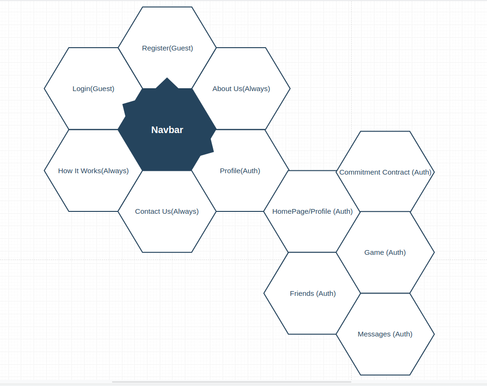

# dopa-client

In development, 

# Demo Images 
### In development!

Technologies used: 
[Vue.js (2.5)](https://vuejs.org/) as framework for development.
[Vue CLI 3](https://github.com/vuejs/vue-cli) for project scaffolding.
[Vue Router](https://router.vuejs.org/) for handling routes.
[Bootstrap 4](https://getbootstrap.com/docs/4.0/getting-started/introduction/) as a general css foundation.
[Element UI](http://element.eleme.io/#/en-US/component/installation) for some complex js components such as tooltips, datepickers, popovers.

